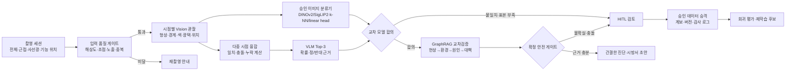

# AI 비전 진단 고도화 계획

작성일: 2026-07-24

## 1. 목표

Mold Master AI의 비전 진단을 단일 사진 분류 기능이 아니라 다음 원칙을
따르는 제조 품질 진단 계층으로 고도화한다.

1. 사진에서 실제 관찰 가능한 특징만 구조화한다.
2. 여러 시점의 사진을 하나의 촬영 세션으로 묶어 상호 검증한다.
3. 결함 후보는 Top-3와 신뢰도, 반대 근거, 추가 촬영 요구를 함께 반환한다.
4. 원인과 대책은 비전 모델이 임의 생성하지 않고 승인된 Graph DB 근거를
   우선 사용한다.
5. 근거가 부족하거나 관찰끼리 충돌하면 자동 확정하지 않고 HITL 검토로
   전환한다.
6. 사람의 수정 결과는 원본, 판정, 근거, 모델 버전을 보존한 상태에서만
   재학습 데이터로 승격한다.

비전 AI는 사람의 눈을 대체하는 최종 판정자가 아니라, 재현 가능한 관찰을
수집하고 위험한 오판을 보류하는 첫 번째 품질 게이트로 정의한다.

## 2. 현재 기준선

현재 구현된 기능:

- 이미지 품질 게이트와 분석 가능 여부 판정
- 구조화된 Top-3 비전 후보와 선택적 자동 확정
- Vision provider 응답 JSON Schema와 런타임 계약 검증
- VLM 후보와 승인 이미지 classifier 결과의 로컬 합의 게이트
- 승인된 Vision 데이터셋 및 SHA-256 계보 검증
- Graph 우선 검색과 LLM 보조 응답
- HITL 승인, 보류, 반려 및 승인 데이터 승격
- 결함별 필수 촬영 시점 정의와 준비도 평가
- 비영속 Vision/Graph 벤치마크

2026-07-24 중립 blind 재측정 기준선:

| 지표 | 현재 값 | 해석 |
| --- | ---: | --- |
| 표본 수 | 13 | 결함군별 일반화를 판단하기에 부족 |
| Top-1 정확도 | 0.0% | VLM 단독 폐쇄형 분류는 운영 불가 |
| Top-3 정확도 | 7.7% | 후보 생성도 운영 기준 미달 |
| 선택 판정 정확도 | 0.0% | 자동 확정을 계속 차단해야 함 |
| 선택 판정 커버리지 | 0.0% | 모든 건을 사람 검토로 보내야 함 |
| 위험 자동 오판율 | 0.0% | 현재 운영 보류 게이트는 오답 확정을 차단 |
| 촬영 프로토콜 준비도 | 0% | 모델 이전에 입력 데이터 개선 필요 |
| 런타임 계보 준비도 | 실패 | 실행 컨테이너가 prompt/detail 버전을 보고하지 않음 |

과거 46.2% Top-1 결과는 구버전 Vision 프롬프트가 벤치마크의 현장 설명을
읽은 상태에서 산출되어 blind 시각 정확도로 사용할 수 없다. 중립 질문으로
재실행한 결과 정확도는 0%였고, 엄격한 V2 관찰 계약과 lean 후보 프롬프트도
모두 0%였다. 핵심 병목은 모델 크기보다 데이터 수, 촬영 일관성, 폐쇄형
시각 분류기 부재, 런타임 버전 불일치다.

## 3. 목표 아키텍처



시스템의 책임을 분리한다.

- Vision 관찰기: 사진에서 보이는 사실만 출력한다.
- Provider 계약 검증기: 모델 응답이 스키마를 벗어나면 후보를 복구하지 않고
  자동 차단한다.
- 폐쇄형 분류기: 승인 사진의 시각 임베딩과 학습 헤드로 표준 결함 Top-3를
  독립 생성한다.
- 합의 게이트: VLM과 폐쇄형 분류기의 Top-1, 신뢰도, 참조 표본 수를
  비교하고 불일치 시 Graph 검색을 차단한다.
- Graph 검증기: 승인된 원인·대책 경로와 조건 일치도를 계산한다.
- 안전 게이트: 자동 확정, 추가 촬영, 사람 검토를 결정한다.
- 보고서 작성기: 검증된 결과만 짧은 문장으로 변환한다.

## 4. 권장 기술 스택

### 4.1 프론트엔드 촬영 계층

- Electron + React + TypeScript 유지
- MediaDevices API 기반 다중 촬영 세션
- Web Worker 또는 OffscreenCanvas 기반 사전 품질 검사
- OpenCV.js 선택 도입: 초점, 노출, 기하 왜곡, 중복 프레임 검사
- 이미지 원본 SHA-256, 촬영 시점, 조명, 카메라, ROI를 메타데이터로 저장

### 4.2 Vision 추론 계층

- OpenAI Responses API의 이미지 입력과 JSON Schema 구조화 출력
- 고정 모델명이 아니라 `vision-primary`, `vision-review`,
  `vision-economy` 역할별 설정
- 원본 해상도 분석은 결함 근접 사진에만 사용하고 전체 사진은 비용 최적화
- 시점별 독립 관찰 후 결정론적 융합기를 거쳐 Top-3 생성
- 모델 교체 시 동일 승인셋으로 shadow evaluation 후 승격
- DINOv2 또는 SigLIP2 임베딩 기반 승인 이미지 k-NN/prototype 기준선
- 데이터 30세션/클래스 확보 후 frozen encoder + linear head 비교
- 정상 이미지가 충분한 제품군은 Anomalib의 PatchCore 계열을 별도
  이상 위치 탐지기로 평가
- ROI 자동화가 필요한 단계에서만 SAM 2를 추가하고 결함 분류기로 사용하지 않음
- Windows 배포는 PyTorch 기준선 측정 후 ONNX Runtime 또는 OpenVINO
  변환 가능성을 비교

구조화 출력 필수 필드:

```text
observations[]
candidate_defects[1..3]
supporting_evidence[]
contradicting_evidence[]
missing_views[]
confidence
abstain_reason
model_snapshot
prompt_version
```

### 4.3 Agent 및 Graph 계층

- LangGraph 상태 그래프와 영속 checkpointer
- 단계별 interrupt: 추가 촬영, 낮은 신뢰도, Vision-Graph 충돌, 승인 대기
- Common Agent를 중앙 Graph·문서 지식 서비스로 유지
- Neo4j GraphRAG의 vector + Cypher traversal 하이브리드 검색
- 허용 경로: `현상 -> 발생 위치 -> 공정 조건 -> 원인 -> 확인 방법 -> 대책`
- 원인·대책 노드는 승인 상태, 근거 출처, 적용 제품군, 공정 조건을 필수 보유

### 4.4 평가 및 관측성

- 고정 golden set, 최근 현장셋, 어려운 hard-negative 셋을 분리
- OpenTelemetry 기반 요청 추적과 모델·프롬프트·Graph 버전 기록
- 모든 실행에 `capture_session_id`, `vision_run_id`, `graph_trace_id`,
  `review_decision_id` 부여
- 원본 이미지와 민감한 프롬프트 본문은 기본 telemetry에서 제외
- 모델 비용, 지연, 재시도, 보류율, HITL 수정률을 함께 측정

## 5. 단계별 개발 로드맵

### Phase 1. 촬영 세션과 입력 품질 게이트

기간: 1~2주

개발 상태: 2026-07-24 소프트웨어 구현 및 자동화 검증 완료. 실제 외부
카메라 촬영과 승인 현장 사진 준비도 80% 검증은 운영 확인 대기.

개발:

- 전체 제품, 결함 근접 사진을 모든 물리 제품의 최소 필수 시점으로 지정
- 결함별 사선광, 취출 위치, 파팅라인, 유동 말단 등 추가 시점 요구
- 한 제품의 사진들을 `capture_session_id`로 그룹화
- 필수 시점이 없으면 AI 진단 버튼을 차단하고 재촬영 지시
- 파일 업로드, 화면 캡처, 외부 카메라에 동일 메타데이터 적용

합격 기준:

- 물리 제품 진단의 촬영 프로토콜 준비도 80% 이상
- 필수 시점 누락 상태에서 분석 요청 0건
- 동일 이미지 중복 등록률 1% 미만

### Phase 2. 구조화된 시각 관찰 분리

기간: 2주

개발 상태: 2026-07-24 V2 구조화 관찰 계약, 관찰 ID 기반 후보 근거,
정상·문서 hard-negative, Vision/Graph 책임 분리 및 Electron 자동화 검증
완료. 2026-07-27 품질 `reject/fail` 이미지는 후보를 제거하고 Graph 질의에
결함명을 전달하지 않는 재촬영 보류 계약을 추가했다. 또한 VLM이
`quality_status`를 생략하더라도 `motion blur`, `ROI too small`, 식별 불가,
심한 과노출/저노출 같은 `quality_concerns`를 반환하면 자동으로 품질 reject로
승격해 후보 사용을 차단한다. 이어서 신규 provider V2 관찰에는 필수
`region_bbox`를 추가해 각 관찰의 정규화 위치 좌표와 confidence를 검증하고,
Graph 검색 쿼리와 분석 모달에 bbox 근거를 함께 표시하도록 했다. 기존
Common Agent/과거 데이터는 bbox가 없어도 읽을 수 있게 호환성을 유지한다.
분석 모달 이미지 위에는 bbox overlay를 추가해 작업자가 AI가 본 관찰 위치를
즉시 검수할 수 있게 했다. Common Agent 동기화 시에는 Vision observation
bbox를 `candidate` annotation payload로 함께 전송해, 사람 승인 전 위치 근거를
중앙 데이터셋의 HITL 검토 후보로 남기도록 했다. 동기화 후에는 Common Agent
annotation 응답을 Vision observation id별로 요약해 candidate/approved/rejected/
missing 상태를 분석 모달에 표시하고, bbox 검수 완료와 Graph 승격을 분리한다.
또한 overlay 번호를 observation id 기반 lookup과 연결해 이미지 위 bbox와
오른쪽 관찰 카드가 같은 `#번호`와 primary/secondary 색상 톤을 공유하게 했다.
이어서 bbox overlay를 클릭 가능한 검수 컨트롤로 바꿔 선택한 observation 카드가
자동 스크롤 및 active 강조되도록 했다.
추가로 `vision-bbox-hitl-review/v1` 패킷을 생성해 원본 bbox, 보정 후보 bbox,
observation id, 검토 사유를 Common Agent/HITL에 전달할 수 있게 했으며, 분석
모달 관찰 카드에서 해당 패킷을 복사할 수 있게 했다. 이 패킷은 사람 승인 전
Graph 승격과 학습 승격을 모두 차단한다. 이어서 관찰 카드에 x/y/width/height
수동 보정 draft 입력을 추가해 유효한 normalized 좌표만 `corrected_bbox`로
패킷에 포함되도록 했다. Common Agent에 이미 동기화된 이미지는 관찰 카드의
`Common Agent 제출` 버튼으로 보정 bbox를 `needs_review` annotation으로 직접
제출하고, 제출 후 annotation summary를 다시 갱신한다.
또한 Vision safety gate가 촬영 view별 bbox calibration profile을 적용해
`defect_closeup`, `oblique_light`, `parting_line_context` 등 정밀 검수가 필요한
시점에서는 기본값보다 엄격한 bbox confidence/area 기준으로 자동 Graph 후보
사용을 보류한다. bbox 위치 근거가 약한 경우에는 단순 보류에 그치지 않고
초점/조명 보정 재촬영, 결함 부위 중심 근접 재촬영 같은 `requiredAdditionalViews`
지시를 자동 생성한다. 이 재촬영 요청은 HITL review metadata와 재평가 plan에도
`vision_safety_gate_reasons`, bbox calibration profile, weak bbox count와 함께
전달되어 Common Agent가 field follow-up 사유를 잃지 않도록 했다. 이후 재촬영한
fresh image도 `vision-recapture-lineage/v1` metadata로 원본 local image,
원본 Common Agent image, review decision, safety reason, 요청 view와 연결할 수
있게 했다. 2026-07-27에는 HITL에서 `recapture`를 선택하면 다음 신규 화면 캡처,
카메라 촬영, 모바일 업로드, 파일 업로드, 드래그 앤드 드롭 이미지에 해당
recapture lineage source가 한 번 자동 주입되도록 앱 흐름까지 연결했다. 세션
패널에는 “재촬영 연결 대기” 배지를 표시해 작업자가 다음 사진이 원본 보류
케이스와 이어질 예정임을 확인할 수 있다. 이어서 `vision-recapture-capture-
guidance/v1`을 추가해 bbox 과대 영역, 낮은 bbox 신뢰도, 사선광/광택 확인,
취출·파팅라인 같은 재촬영 사유를 다음 권장 촬영 시점으로 변환한다. 화면
캡처 기본 시점과 카메라 모달 선택값은 이 권장값으로 자동 전환되고, 모바일·
파일·드래그 업로드도 재촬영 대기 상태에서는 권장 `captureViewTag` metadata를
자동 부착한다. 또한 fresh recapture upload의 `buildCaptureMetadata()` 결과에
`recapture_guidance_protocol_version`, `recapture_recommended_view_tag`,
`recapture_guidance_reason_codes`, `recapture_guidance_instructions`를 함께
보존해 Common Agent와 GraphRAG 재평가가 재촬영 의도와 실제 촬영 시점을 추적할
수 있게 했다. Fresh recapture 이미지의 실제 `captureViewTag`가 권장 시점과
일치하는지도 `recapture_guidance_fulfilled`,
`recapture_guidance_fulfillment_status`, `recapture_actual_view_tags`로 기록해,
잘못된 시점으로 다시 촬영된 이미지는 `view_mismatch`로 분리할 수 있다. 이후
HITL 승인 metadata의 학습 적격성도 `resolveCaptureLearningEligibility()`로
계산해, 사람이 승인하더라도 재촬영 권장 시점이 충족되지 않은 이미지는
`learning_candidate_eligible=false`,
`capture_learning_candidate_eligibility_reason=recapture_guidance_view_mismatch`
로 남겨 GraphRAG/vision reference 학습 승격을 차단한다. Readiness 계산에서도
`capture_learning_candidate_eligible=false` 또는 `learning_candidate_eligible=false`
가 명시된 승인 이미지는 `cleanApproved`, class coverage, sample gate에서 제외하고,
설정/DB 화면에는 `학습 제외 N건`과 사유 요약을 노출할 수 있게 했다.
실제 승인 사진을
사용한 라이브 모델 JSON 준수율과 오판율 측정은 운영 검증 대기.

개발:

- 결함명 예측 전에 경계, 색 변화, 광택, 반복 형상, 위치를 먼저 관찰
- 관찰 사실과 추론을 별도 JSON 필드로 저장
- 정상 형상과 결함을 구분하는 hard-negative 규칙 추가
- 이미지 종류가 도면, 화면, 문서이면 물리 결함 자동 판정 금지
- 모든 V2 결함 후보가 유효한 `observation_id`를 인용하도록 fail-closed 처리
- 신규 provider V2 관찰은 `normalized_xywh` bbox를 필수로 반환해 AI가 본
  위치 근거를 저장
- 품질 `reject/fail` 이미지는 고신뢰 후보도 폐기하고 `image_quality_rejected`
  상태로 재촬영을 요구
- 재촬영급 `quality_concerns`만 반환된 경우도 후보를 폐기하고 Graph 후보
  사용을 차단
- 비전 단계의 원인·대책·현장 설명을 Graph 질의 근거와 분리

합격 기준:

- JSON Schema 준수율 100%
- 관찰 근거 없는 결함 후보 반환 0건
- 문서·도면의 물리 결함 오판 0건
- 품질 reject/fail 이미지의 Graph 후보 전달 0건
- 품질 우려 기반 재촬영 이미지의 Graph 후보 전달 0건
- 신규 provider 응답의 bbox 계약 오류가 자동 후보로 전달되는 건 0건

### Phase 3. 다중 시점 융합과 선택적 판정

기간: 2~3주

개발 상태: 2026-07-24 `vision-fusion/v1` 결정론적 융합기, 세션 전체
multipart 전송, 시점별 독립 Vision V2 관찰, 시점·관찰 범주 가중치,
후보 충돌·필수 시점 누락·정상 반대 근거 안전 게이트, 시점별 데이터 계보,
Graph 전달 및 Electron 자동화 검증 완료. 승인 현장 사진을 이용한 클래스별
temperature/isotonic calibration과 목표 정확도 측정은 운영 검증 대기.
2026-07-27 comparison record와 운영 관측성에 Vision 판정 상태별 확정률,
보류율, 판정불가율과 보류 사유 타깃을 추가했다. 설정 화면과 전환 리포트
JSON에서 `dual_model_disagreement`, `image_quality_rejected`처럼 자동 확정을
막은 1차 사유를 확인할 수 있으며, classifier agreement 사유가 실제 보류
사유를 덮지 않도록 guard 우선순위도 정리했다. 추가로 Vision 판정 사유를
재촬영 품질 개선, VLM/Classifier 불일치 검토, 다중 시점 촬영 보강 같은
운영 조치로 변환해 설정 화면과 전환 리포트 JSON에 표시하도록 했다. 이어서
품질 거절, 모델 불일치, 시점 부족 사유를 우선순위가 있는 HITL 검토 큐로
변환하고 샘플 이미지 ID를 함께 노출해 운영자가 실제 검토 대상을 바로 찾을
수 있게 했다. 전환 리포트 JSON에는 `diagnosis-vision-review-packet/v1`
경량 패킷을 추가해 imageId, comparisonId, action code, defect/classifier
후보, 촬영 컨텍스트를 Common Agent/HITL에 전달할 수 있게 했으며, 이 패킷은
쓰기와 Graph 승격을 금지하고 사람 검토를 필수로 요구한다. 진단 결과 모달에는
`Vision 판정 사용 정책`, Graph 후보 사용 가능 여부, AI가 본 근거 영역,
재촬영/검토 사유를 함께 표시해 비전 오판이 후속 원인/대책으로 번지는지
작업자가 즉시 확인할 수 있게 했다. 품질 우려로 Vision 후보를 Graph에
사용할 수 없는 negative-flow에서는 `원인/대책 생성 차단` 안내를 표시하고,
미검증 Vision 원인/대책 문장을 계속 숨기는 Electron 스모크를 추가했다.
관리자 모드에서도 품질 반려·판정 보류 Vision 결과는 `승인·Graph 승격`
버튼을 `Graph 승격 차단`으로 대체하고, App 저장 경로에서도 동일 guard로
승격 요청을 fail-closed 처리한다. 이어서 `vision-consensus-gate/v1`을 추가해
Vision-only LLM 원인/대책 확정을 `missing_graph_grounding`으로 차단하고,
Graph 충돌과 classifier 불일치는 최종 확정 및 LLM 보조를 모두 보류하도록
통합했다. 분석 모달에는 Graph 검색, 최종 확정, LLM 보조 허용 여부와 1차
차단 사유를 표시한다.

개발:

- 시점별 독립 Top-3를 계산한 뒤 결함 taxonomy 기준으로 융합
- 전체 사진은 위치·형상, 근접 사진은 표면·경계 증거에 가중치 부여
- 시점 간 불일치와 반대 근거를 점수화
- 신뢰도 보정은 클래스별 temperature/isotonic calibration 비교
- 자동 확정, 추가 촬영, 사람 검토의 세 가지 출구 제공
- 결과 화면에서 Vision 후보의 Graph 사용 정책, 근거 영역, 재촬영/검토
  사유를 직접 표시
- Vision 후보 사용 금지 상태에서는 원인/대책 생성 차단 안내를 표시하고
  승인 전 미검증 대책 삽입을 금지
- 관리자 승인 UI와 실제 Common Agent review 제출 경로 모두에서 blocked
  Vision 결과의 Graph 승격을 차단
- 동일 세션의 최대 8개 이미지를 단일 요청으로 전송하고 개별 서버 ID 보존
- 시점별 관찰 ID를 전역 고유 ID로 변환해 교차 시점 근거 충돌 방지
- Graph에는 개별 시점의 원인 추측이 아닌 융합 관찰과 후보만 전달
- 승인 이미지 분류기와 VLM의 Top-1이 일치하고 참조 표본이 3건 이상일
  때만 Graph 검색을 허용
- 교차 모델 불일치, 분류기 증거 누락, 필수 촬영 시점 누락은 fail-closed
  처리

합격 기준:

- Top-3 정확도 85% 이상
- 자동 확정 정확도 95% 이상
- 위험 자동 오판율 2% 이하
- 자동 확정 커버리지 50% 이상

### Phase 3.5. 폐쇄형 시각 분류기

기간: 데이터 확보 후 2~4주

개발 상태: 2026-07-24 Common Agent에 `VLM + 참조 이미지 분류기` 합의
계약과 Graph 검색 차단 로직을 구현했다. 2026-07-25 Mold Master AI의
Common Agent 진단 진입점에도 승인 참조 이미지 벤치마크 게이트를 연결했다.
설정 화면에서 `off`, `shadow`, `enforce` 모드를 선택하고 모델 버전,
필수 결함군, 샘플 수, Top-1/Top-3 기준을 저장할 수 있다. 2026-07-27
Common Agent worker 환경에서 DINOv2 `facebook/dinov2-base`와 SigLIP2
`google/siglip2-base-patch16-224` 실제 런타임 스모크를 완료했고, benchmark
응답에 provider, model, dimension, device, runtime, production-ready 계보를
노출하도록 확장했다. 또한 `GET /v1/vision/classifier/references/current`로
현재 reference store 준비 상태를 조회하고, Mold Master AI 데이터 관리자에서
상태 확인과 수동 refresh를 실행할 수 있게 했다. `npm run
vision:reference:gate`는 `current -> refresh -> current -> benchmark-current`
순서로 외부 서버 실측 artifact를 생성한다. 학습 헤드는 승인 다중 시점
데이터가 클래스별 최소 30세션에 도달한 뒤 실측 holdout 기준으로 승격한다.
2026-07-27 Mold Master AI는 Common Agent 진단 응답의 `classifier_report`를
정규화해 `visionSummary.classifierSummary`에 보존하고, VLM Top-1과
classifier Top-1이 불일치하거나 참조 수가 부족하면 Graph grounding이 있어도
자동 확정과 원인·대책 본문 출력을 차단한다. 또한 comparison record와
observability 집계에 classifier 합의율, 불일치율, 참조 부족률, 평균 참조
수를 저장해 데이터 수집과 HITL 검토 우선순위를 추적한다. 설정 모달의 진단
운영 관측성 패널과 전환 리포트 JSON에서도 같은 지표를 표시해 운영자가
전환/데이터 보강 결정을 바로 확인할 수 있게 했다. classifier 불일치와 참조
부족이 감지되면 촬영 프로토콜·ROI·라벨 taxonomy 검토 또는 승인 이미지 추가
수집을 권장 조치로 표시한다. 이어서 observability에 `Vision 후보 ->
Classifier 후보` 충돌쌍과 참조 부족 결함군별 평균 참조 수/목표 참조 수를
저장해 `백화 -> 웰드라인`처럼 실제로 검토할 라벨쌍과 우선 수집 대상을
설정 화면 및 전환 리포트 JSON에서 바로 확인할 수 있게 했다.

개발:

- DINOv2와 SigLIP2 frozen embedding을 동일 holdout에서 비교
- 첫 기준선은 cosine k-NN 및 클래스 prototype으로 구성
- 30세션/클래스 이후 linear head와 PatchCore를 비교
- 참조 이미지 ID, encoder 버전, 거리, 클래스 표본 수를 추론 결과에 저장
- VLM과 분류기 불일치 시 원인·대책 Graph 검색을 시작하지 않음
- 정상/불량 쌍이 없는 클래스는 자동 확정 대상에서 제외
- Common Agent의 `/v1/vision/classifier/benchmark-current` 결과가 기준
  미달이면 `enforce` 모드에서 Mold Master AI가 Graph 진단을 차단하고 기존
  AI fallback 또는 HITL 검토로 전환

합격 기준:

- 제품군·금형·카메라가 분리된 holdout Top-1 85% 이상
- Top-3 95% 이상
- 선택 정확도 95% 이상, 선택 커버리지 60% 이상
- 위험 자동 오판율 1% 이하
- 클래스별 재현율 80% 이상

### Phase 4. GraphRAG 교차검증

기간: 2주
개발 상태: 2026-07-24 소프트웨어 구현 및 자동 검증 완료. 승인된 현장
진단 세트로 Graph 인용률 90% 이상을 측정하는 운영 검증은 데이터 확보 후 진행한다.

개발:

- Vision Top-3 각각에 대해 승인된 원인·대책 경로 검색
- 제품군, 공정, 발생 위치, 사출 조건으로 Graph 후보를 필터링
- 직접 매칭과 2~3 hop 경로를 분리 점수화
- Graph 근거가 없는 경우 LLM 보조 지식을 별도 표시하고 자동 저장 금지
- Vision-Graph 충돌 시 강제 HITL 전환
- 후보별 Graph 검색을 병렬 수행하고 승인된 노드·관계로 구성된 경로만 채택
- 승인 경로의 Cause/Action 노드만 시방서 원인·대책 필드로 전달
- Graph 미검증 LLM 문장을 별도 표기하고 학습 적격 값을 항상 false로 저장
- Graph 인용 커버리지, 충돌률, 자동 확정률, 미검증 LLM 학습 누출을 운영 지표로 기록
- 분석 모달에서 직접 매칭, 1~3 hop, 문맥 점수, 경로 ID와 HITL 상태 표시

합격 기준:

- 최종 원인·대책의 Graph 인용률 90% 이상
- 존재하지 않는 Graph 경로 인용 0건
- Graph 근거 부족 시 LLM 내용이 승인 데이터로 자동 승격되는 건 0건

소프트웨어 검증:

- 승인되지 않은 경로 채택 0건
- 존재하지 않는 경로 ID 생성 0건
- Graph 미검증 LLM의 원인·대책 필드 주입 0건
- Graph 미검증 LLM 학습 적격 상태 생성 0건

### Phase 5. HITL 학습 루프

기간: 2주
개발 상태: 2026-07-24 소프트웨어 구현 및 자동 검증 완료. 월별 반복 오류
클래스 감소와 교정 사례의 현장 재현율은 승인 데이터가 누적된 후 운영 검증한다.
2026-07-27 Mold Master AI의 HITL review payload에
`vision-hitl-review/v1` 메타데이터를 추가했다. `corrected`는
`vision_candidate_recheck`, `recapture`는 `vision_recapture_required` 큐로
명시되며, blocked Vision 분석은 Graph 승격 허용 값과 차단 사유를 함께
Common Agent에 전달한다. Electron HITL 스모크는 실제 review request body에
프로토콜 버전, next action, queue, Graph 승격 허용, 학습 적격 값이 포함되는지
검증한다.
이어서 `vision:hitl:reeval-plan` 명령을 추가해 Common Agent dataset rows의
HITL metadata를 재평가 plan으로 변환한다. `corrected` 항목은
`eval/vision-hitl-recheck/manifest.json`의 shadow benchmark 후보가 되고,
`recapture` 항목은 새 이미지가 들어오기 전까지 benchmark와 reference learning
대상에서 제외된다.
또한 통합 migration gate와 DatabaseView benchmark 결과 패널에
`Vision HITL Re-evaluation` 요약을 추가해 recheck 후보, 재촬영 대기, HITL
보류, metadata 차단 건수가 0이 아닐 때 운영 승격을 막도록 했다.
다음 단계로 `vision:hitl:reeval-verify` post-check를 추가했다. shadow
benchmark 결과에서 Top-1/Top-3, accepted prediction, unsafe error, 품질,
Vision contract, 촬영 protocol을 모두 통과한 교정 건만 사람 승인 후보로
분류하고, 실패·재촬영·누락 건은 다시 HITL/재촬영 blocker로 migration gate에
표시한다.

개발:

- 리뷰 화면에 원본 시점, Vision 관찰, Top-3, 반대 근거, Graph 경로 표시
- 승인·수정·반려·재촬영의 네 가지 판정 제공
- 사람 수정은 새 버전으로 저장하고 모델 원출력은 불변 보존
- 클래스 불균형, 반복 오류, 낮은 합의 사례를 우선 검토 큐로 전송
- 충분한 데이터가 모이기 전에는 모델 fine-tuning 대신 few-shot 예제와
  retrieval 개선을 우선
- 최초 모델 출력과 사람 교정본을 부모 버전 ID가 연결된 불변 리비전으로 저장
- 승인 외 결정은 Graph 승격과 로컬 지식 행렬 학습을 차단
- 승인 외 결정은 Common Agent에 재평가 큐, 재촬영 큐, 제외 큐로 구조화해
  전달
- 교정 큐는 별도 shadow benchmark manifest로 변환해 blind Vision 재평가를
  실행
- 재촬영 큐는 새 이미지가 들어오기 전까지 benchmark와 reference store
  refresh 대상에서 제외
- 통합 migration gate에서 HITL recheck/recapture/pending/blocker 상태를
  직접 표시하고, 남은 항목이 있으면 운영 승격을 차단
- HITL recheck benchmark 후 post-check를 실행해 통과 건만 사람 승인 후보로
  분류하고 실패·재촬영·누락 건은 다시 차단 큐로 순환
- 재촬영 요청은 우선순위 100으로 검토 큐 최상단에 배치
- 반복 모델 교정, 희소 클래스, Vision-Graph 충돌을 코호트 우선순위에 반영
- 승인 데이터도 fine-tuning 자동 실행 없이 `candidate_only` 상태로 격리

합격 기준:

- 승인 이력 및 원본 계보 누락 0건
- 수정 사례 재평가 재현율 100%
- 월별 반복 오류 클래스 감소

소프트웨어 검증:

- 최초 모델 출력 덮어쓰기 0건
- 승인 외 Graph 승격 허용 0건
- 재촬영 요청 데이터의 학습 적격 처리 0건
- 검토 리비전의 부모 버전 누락 0건

### Phase 6. 운영 승격과 지속 평가

기간: 2주 이후 상시

개발 상태: 2026-07-24 shadow baseline/candidate 쌍 비교, 날짜·제품군·금형·
카메라·촬영 세션·원본 해시 누수 감사, 모델·프롬프트·Graph 버전 계보,
Top-1/Top-3·선택 정확도·위험 오판·ECE·P95 회귀 게이트, 직전 스냅샷
롤백 판정, CLI 보고서 생성과 앱 등록·표시·내보내기까지 소프트웨어 구현 및
자동 검증 완료. 2026-07-27에는 승격·Shadow 보류·롤백 판단을 공통
결정 카드로 표준화해 설정 화면, CLI artifact, legacy report import가 같은
운영 조치와 대상 스냅샷을 사용하게 했다. 이어서 담당자, 코멘트, 확인 시각,
대상 스냅샷, 자동 적용 금지 여부를 `operatorDecision`으로 저장하고 전환
리포트 JSON에 포함하도록 했다. 또한 baseline/candidate benchmark, release
config, Common Agent export URI, Graph snapshot URI를 `evidenceBundle`로
표준화하고 카드와 담당자 확인 기록에 같은 근거 묶음을 붙였다. 같은
릴리스 보고서를 import 후 담당자가 확인하면 최신 1건만 덮어쓰지 않고
`vision-operational-release-history/v1` 이력에 누적·갱신하며, Settings
화면과 전환 리포트 JSON에 총 이력, 근거 완료, 운영 확인, 최신 상태를
함께 내보낸다. 또한 운영 근거 정합성 감사(`vision-operational-evidence-
alignment/v1`)를 추가해 benchmark/config SHA-256, 고정 Common Agent export
URI, 후보 `graphVersion`과 일치하는 Graph snapshot URI가 확인되지 않으면
담당자 운영 확인을 저장하지 않는다. 이어서 Common Agent/Antigravity가
내보낸 중앙 증거를 `vision-operational-evidence-packet/v1`로 받아 release
config에 병합하는 CLI를 추가해, 실제 운영 benchmark 생성 전 URI 수기 입력
오류를 줄였다. 누적 history는 `vision-operational-release-trend/v1`로
반복 차단 원인, 근거 준비율, 운영 확인율, 다음 조치까지 요약해 Settings와
전환 리포트 JSON에 함께 노출한다. 또한 `vision-operational-readiness-
audit/v1`과 `npm run vision:operational:readiness`를 추가해 reference gate,
post-HITL 검증, release report, evidence alignment를 최종 go/no-go 감사
artifact 하나로 묶었다. 현재 PC의 실제 artifact 기준 실행 결과는
`action_required`이며, reference store 미구축, 승인 샘플 8건 부족, 4개
라벨 충돌 그룹, 12건 HITL 미해결, operational release report 부재가 남은
차단 원인이다. 이어서 `vision-operational-blocker-worklist/v1`과
`npm run vision:operational:worklist`를 추가해 readiness blocker를 담당자별
작업 목록으로 변환한다. 현재 실행 결과는 5개 작업이며 최우선 작업은 라벨
충돌 해결(`resolve_label_conflicts`)이다. 2026-07-27에는 Settings의 비전
릴리스 게이트와 전환 리포트 JSON에도 같은 운영 작업 목록, readiness audit,
Common Agent handoff 안전 정책을 노출해 CLI artifact를 열지 않아도 현재
차단 상태를 확인할 수 있게 했다. 이어서
`vision-operational-common-agent-handoff-packet/v1`과
`npm run vision:operational:handoff`를 추가해 blocker worklist를 Common
Agent/Antigravity가 이어 받을 수 있는 artifact-only 패킷으로 묶었다. 이
패킷은 현재 `blocked`, `manualImportAllowed=false`, `serviceWritesPerformed=false`
이며 Graph/Model 자동 승격을 명시적으로 금지한다. 또한 최우선 blocker인
승인 라벨 충돌을 처리하기 위해
`vision-approved-label-conflict-review-packet/v1`과
`npm run vision:label-conflicts:packet`을 추가했다. 현재 실제 artifact 기준
4개 충돌 그룹이 `action_required`로 패키징되며, 각 그룹은 정답 라벨 유지,
needs_review 전환, rejected 전환, 재촬영 요청 중 하나를 사람이 선택해야
한다. 실제 승인 현장 데이터의 운영 합격 판정은 계속 보류한다.

개발:

- 기존 모델과 후보 모델을 shadow mode로 동시 평가
- 날짜, 제품군, 금형, 카메라 단위 데이터 분리로 누수 방지
- 모델·프롬프트·Graph 변경마다 승인셋 회귀 테스트
- 성능 하락 시 직전 스냅샷으로 즉시 롤백

운영 합격 기준:

- 클래스별 재현율 80% 이상
- Expected Calibration Error 0.08 이하
- 재촬영 포함 P95 진단 지연 목표 이내
- 신규 제품군에서 자동 확정 전 최소 30건 사람 검증

## 6. 데이터 확보 계획

40개 웹 사례는 원인·대책 Graph 보강에는 사용할 수 있지만 Vision 정확도
학습셋으로 바로 사용하지 않는다. 촬영 조건과 원본 결함 라벨이 불명확하기
때문이다.

Vision 데이터 우선순위:

1. 같은 제품의 정상·불량 쌍
2. 같은 결함의 전체·근접·사선광 사진
3. 다른 결함처럼 보이는 hard-negative
4. 제품군, 수지, 금형, 공정 조건이 다른 반복 사례
5. 판정 불가와 재촬영 사례

1차 목표는 핵심 결함 8종마다 승인 세션 30건 이상이다. 각 세션은 최소 두
시점을 포함하므로 최소 480장 이상이 필요하다. 모델 학습보다 평가 신뢰성을
먼저 확보한다.

## 7. 안전 및 중단 조건

다음 조건에서는 자동 결함 확정을 금지한다.

- 필수 시점 누락 또는 사진 품질 미달
- Top-1과 Top-2 점수 차이가 클래스별 임계값 미만
- 시점별 후보가 상충
- Vision 관찰과 Graph 조건이 상충
- Graph 근거가 승인되지 않았거나 적용 제품군이 다름
- 신규 제품군 또는 신규 결함 클래스
- 모델, 프롬프트, taxonomy 버전이 평가되지 않음

최종 사용자에게 내부 chain-of-thought는 노출하지 않는다. 대신 관찰 사실,
인용 가능한 Graph 경로, 반대 근거, 신뢰도, 추가 확인 항목으로 구성된
감사 가능한 근거 추적을 제공한다.

## 8. 즉시 구현 순서

Phase 1~6의 안전·Graph·HITL 소프트웨어 기반은 구현했지만 blind Vision
정확도는 운영 기준을 통과하지 못했다. 다음 사이클은 승인 현장 데이터와
폐쇄형 분류기를 먼저 구축하는 단계다.

1. 현재 13개 표본을 모두 촬영 프로토콜 미달 코호트로 격리
2. 핵심 결함군마다 최소 30개의 승인된 다중 시점 세션 확보
3. 제품군·금형·카메라·촬영 날짜 단위로 학습/holdout 분리 확정
4. DINOv2/SigLIP2 k-NN 기준선과 VLM 기준선을 독립 측정
5. 교차 모델 합의 결과를 Common Agent 융합 계약에 연결
6. 중립 blind 벤치마크와 `npm run eval:vision:release`를 연속 실행
7. 보고서를 앱의 비전 릴리스 게이트에 등록하고 HITL 담당자가 승인
8. 회귀 발생 시 모델·프롬프트·Graph 직전 스냅샷으로 롤백

실제 승인 사진으로 촬영 준비도 80%와 클래스별 calibration을 달성하기
전에는 `vision-fusion/v1`의 자동 확정 임계값을 완화하지 않는다.

2026-07-25 이후 다음 개발 단위:

1. Common Agent에 연결된 DINOv2/SigLIP2 실제 임베딩 런타임으로 승인 현장
   데이터 reference store를 생성하고 `npm run vision:reference:gate` 실측
   artifact로 benchmark를 교체
2. Mold Master 설정의 Vision 벤치마크 게이트를 `shadow`로 전환해 진단
   실패 없이 기준 미달 항목을 수집
3. 승인 이미지가 핵심 결함군별 30세션에 도달하면 holdout benchmark를 실행
   후 `enforce`로 승격
4. 2026-07-27 운영 릴리스 보고서의 결정 카드, 담당자 확인 기록,
   evidenceBundle, release history ledger, evidence alignment gate, release
   trend summary, final readiness audit, blocker worklist, Common Agent
   handoff packet, 승인 라벨 충돌 review packet 연결을 구현했고,
   `vision:release:evidence:merge`로 중앙 증거 패킷을 release config에
   병합할 수 있게 했다. 남은 작업은 실제 Common Agent export와 Graph
   snapshot URI가 포함된 운영 benchmark artifact를 승인 현장 데이터로
   생성하고, `npm run vision:operational:readiness`가
   `approved_for_manual_activation`에 도달하는지 반복 검증하며, 중간 차단
   원인은 Settings, `npm run vision:operational:worklist`,
   `npm run vision:operational:handoff`,
   `npm run vision:label-conflicts:packet`에서 함께 확인하는 단계다.
5. 오판 사례는 자동 학습하지 않고 Common Agent HITL 큐에 넣어 수정 라벨,
   반대 근거, 추가 촬영 요구를 함께 저장

## 9. 참고 기술 기준

- OpenAI 최신 멀티모달 모델은 이미지 입력과 구조화 출력을 지원하며,
  모델 별칭과 역할을 분리해 교체 가능한 구성이 필요하다.
- LangGraph checkpointer는 상태 저장, 중단, 사람 승인, 실패 후 재개를
  지원하므로 HITL 실행 기반으로 사용한다.
- Neo4j 공식 GraphRAG 패키지는 vector retrieval과 Cypher traversal을
  결합할 수 있으므로 현상에서 원인·대책까지의 검증 경로에 적합하다.
- OpenTelemetry semantic conventions를 따라 모델, Graph, HTTP 호출의
  추적 필드를 일관되게 운영한다.
- [DINOv2](https://arxiv.org/abs/2304.07193)는 라벨이 적은 환경에서
  이미지 수준 분류와 검색에 사용할 수 있는 self-supervised 특징을 제공한다.
- [SigLIP2](https://arxiv.org/abs/2502.14786)는 다국어 이미지-텍스트
  검색과 dense feature 성능을 개선한 비교 후보이다.
- [SAM 2](https://arxiv.org/abs/2408.00714)는 ROI 분할 보조에 사용하며
  결함 taxonomy 분류를 대신하지 않는다.
- [Anomalib](https://anomalib.readthedocs.io/en/stable/)은 정상 제품 기반
  산업 이상 탐지와 OpenVINO 배포 비교에 사용한다.
