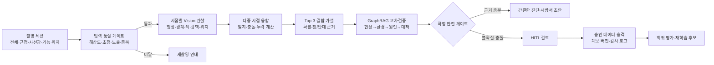

# AI 비전 진단 고도화 계획

작성일: 2026-07-24

## 1. 목표

Mold Master AI의 비전 진단을 단일 사진 분류 기능이 아니라 다음 원칙을
따르는 제조 품질 진단 계층으로 고도화한다.

1. 사진에서 실제 관찰 가능한 특징만 구조화한다.
2. 여러 시점의 사진을 하나의 촬영 세션으로 묶어 상호 검증한다.
3. 결함 후보는 Top-3와 신뢰도, 반대 근거, 추가 촬영 요구를 함께 반환한다.
4. 원인과 대책은 비전 모델이 임의 생성하지 않고 승인된 Graph DB 근거를
   우선 사용한다.
5. 근거가 부족하거나 관찰끼리 충돌하면 자동 확정하지 않고 HITL 검토로
   전환한다.
6. 사람의 수정 결과는 원본, 판정, 근거, 모델 버전을 보존한 상태에서만
   재학습 데이터로 승격한다.

비전 AI는 사람의 눈을 대체하는 최종 판정자가 아니라, 재현 가능한 관찰을
수집하고 위험한 오판을 보류하는 첫 번째 품질 게이트로 정의한다.

## 2. 현재 기준선

현재 구현된 기능:

- 이미지 품질 게이트와 분석 가능 여부 판정
- 구조화된 Top-3 비전 후보와 선택적 자동 확정
- 승인된 Vision 데이터셋 및 SHA-256 계보 검증
- Graph 우선 검색과 LLM 보조 응답
- HITL 승인, 보류, 반려 및 승인 데이터 승격
- 결함별 필수 촬영 시점 정의와 준비도 평가
- 비영속 Vision/Graph 벤치마크

최근 승인 표본 기준선:

| 지표 | 현재 값 | 해석 |
| --- | ---: | --- |
| 표본 수 | 13 | 결함군별 일반화를 판단하기에 부족 |
| Top-1 정확도 | 46.2% | 자동 확정용으로 불충분 |
| Top-3 정확도 | 53.8% | 후보 생성 품질도 개선 필요 |
| 선택 판정 정확도 | 83.3% | 보류 게이트는 유효 |
| 선택 판정 커버리지 | 46.2% | 절반 이상은 사람 검토 필요 |
| 위험 자동 오판율 | 7.7% | 양산 의사결정 기준으로 높음 |
| 촬영 프로토콜 준비도 | 0% | 모델 이전에 입력 데이터 개선 필요 |

핵심 병목은 모델 크기보다 데이터 수, 촬영 일관성, 결함별 시각 특징 정의,
다중 시점 융합 부재다.

## 3. 목표 아키텍처



시스템의 책임을 분리한다.

- Vision 관찰기: 사진에서 보이는 사실만 출력한다.
- 가설 생성기: 표준 결함 taxonomy 안에서 Top-3를 생성한다.
- Graph 검증기: 승인된 원인·대책 경로와 조건 일치도를 계산한다.
- 안전 게이트: 자동 확정, 추가 촬영, 사람 검토를 결정한다.
- 보고서 작성기: 검증된 결과만 짧은 문장으로 변환한다.

## 4. 권장 기술 스택

### 4.1 프론트엔드 촬영 계층

- Electron + React + TypeScript 유지
- MediaDevices API 기반 다중 촬영 세션
- Web Worker 또는 OffscreenCanvas 기반 사전 품질 검사
- OpenCV.js 선택 도입: 초점, 노출, 기하 왜곡, 중복 프레임 검사
- 이미지 원본 SHA-256, 촬영 시점, 조명, 카메라, ROI를 메타데이터로 저장

### 4.2 Vision 추론 계층

- OpenAI Responses API의 이미지 입력과 JSON Schema 구조화 출력
- 고정 모델명이 아니라 `vision-primary`, `vision-review`,
  `vision-economy` 역할별 설정
- 원본 해상도 분석은 결함 근접 사진에만 사용하고 전체 사진은 비용 최적화
- 시점별 독립 관찰 후 결정론적 융합기를 거쳐 Top-3 생성
- 모델 교체 시 동일 승인셋으로 shadow evaluation 후 승격

구조화 출력 필수 필드:

```text
observations[]
candidate_defects[1..3]
supporting_evidence[]
contradicting_evidence[]
missing_views[]
confidence
abstain_reason
model_snapshot
prompt_version
```

### 4.3 Agent 및 Graph 계층

- LangGraph 상태 그래프와 영속 checkpointer
- 단계별 interrupt: 추가 촬영, 낮은 신뢰도, Vision-Graph 충돌, 승인 대기
- Common Agent를 중앙 Graph·문서 지식 서비스로 유지
- Neo4j GraphRAG의 vector + Cypher traversal 하이브리드 검색
- 허용 경로: `현상 -> 발생 위치 -> 공정 조건 -> 원인 -> 확인 방법 -> 대책`
- 원인·대책 노드는 승인 상태, 근거 출처, 적용 제품군, 공정 조건을 필수 보유

### 4.4 평가 및 관측성

- 고정 golden set, 최근 현장셋, 어려운 hard-negative 셋을 분리
- OpenTelemetry 기반 요청 추적과 모델·프롬프트·Graph 버전 기록
- 모든 실행에 `capture_session_id`, `vision_run_id`, `graph_trace_id`,
  `review_decision_id` 부여
- 원본 이미지와 민감한 프롬프트 본문은 기본 telemetry에서 제외
- 모델 비용, 지연, 재시도, 보류율, HITL 수정률을 함께 측정

## 5. 단계별 개발 로드맵

### Phase 1. 촬영 세션과 입력 품질 게이트

기간: 1~2주

개발 상태: 2026-07-24 소프트웨어 구현 및 자동화 검증 완료. 실제 외부
카메라 촬영과 승인 현장 사진 준비도 80% 검증은 운영 확인 대기.

개발:

- 전체 제품, 결함 근접 사진을 모든 물리 제품의 최소 필수 시점으로 지정
- 결함별 사선광, 취출 위치, 파팅라인, 유동 말단 등 추가 시점 요구
- 한 제품의 사진들을 `capture_session_id`로 그룹화
- 필수 시점이 없으면 AI 진단 버튼을 차단하고 재촬영 지시
- 파일 업로드, 화면 캡처, 외부 카메라에 동일 메타데이터 적용

합격 기준:

- 물리 제품 진단의 촬영 프로토콜 준비도 80% 이상
- 필수 시점 누락 상태에서 분석 요청 0건
- 동일 이미지 중복 등록률 1% 미만

### Phase 2. 구조화된 시각 관찰 분리

기간: 2주

개발 상태: 2026-07-24 V2 구조화 관찰 계약, 관찰 ID 기반 후보 근거,
정상·문서 hard-negative, Vision/Graph 책임 분리 및 Electron 자동화 검증
완료. 실제 승인 사진을 사용한 라이브 모델 JSON 준수율과 오판율 측정은
운영 검증 대기.

개발:

- 결함명 예측 전에 경계, 색 변화, 광택, 반복 형상, 위치를 먼저 관찰
- 관찰 사실과 추론을 별도 JSON 필드로 저장
- 정상 형상과 결함을 구분하는 hard-negative 규칙 추가
- 이미지 종류가 도면, 화면, 문서이면 물리 결함 자동 판정 금지
- 모든 V2 결함 후보가 유효한 `observation_id`를 인용하도록 fail-closed 처리
- 비전 단계의 원인·대책·현장 설명을 Graph 질의 근거와 분리

합격 기준:

- JSON Schema 준수율 100%
- 관찰 근거 없는 결함 후보 반환 0건
- 문서·도면의 물리 결함 오판 0건

### Phase 3. 다중 시점 융합과 선택적 판정

기간: 2~3주

개발 상태: 2026-07-24 `vision-fusion/v1` 결정론적 융합기, 세션 전체
multipart 전송, 시점별 독립 Vision V2 관찰, 시점·관찰 범주 가중치,
후보 충돌·필수 시점 누락·정상 반대 근거 안전 게이트, 시점별 데이터 계보,
Graph 전달 및 Electron 자동화 검증 완료. 승인 현장 사진을 이용한 클래스별
temperature/isotonic calibration과 목표 정확도 측정은 운영 검증 대기.

개발:

- 시점별 독립 Top-3를 계산한 뒤 결함 taxonomy 기준으로 융합
- 전체 사진은 위치·형상, 근접 사진은 표면·경계 증거에 가중치 부여
- 시점 간 불일치와 반대 근거를 점수화
- 신뢰도 보정은 클래스별 temperature/isotonic calibration 비교
- 자동 확정, 추가 촬영, 사람 검토의 세 가지 출구 제공
- 동일 세션의 최대 8개 이미지를 단일 요청으로 전송하고 개별 서버 ID 보존
- 시점별 관찰 ID를 전역 고유 ID로 변환해 교차 시점 근거 충돌 방지
- Graph에는 개별 시점의 원인 추측이 아닌 융합 관찰과 후보만 전달

합격 기준:

- Top-3 정확도 85% 이상
- 자동 확정 정확도 95% 이상
- 위험 자동 오판율 2% 이하
- 자동 확정 커버리지 50% 이상

### Phase 4. GraphRAG 교차검증

기간: 2주
개발 상태: 2026-07-24 소프트웨어 구현 및 자동 검증 완료. 승인된 현장
진단 세트로 Graph 인용률 90% 이상을 측정하는 운영 검증은 데이터 확보 후 진행한다.

개발:

- Vision Top-3 각각에 대해 승인된 원인·대책 경로 검색
- 제품군, 공정, 발생 위치, 사출 조건으로 Graph 후보를 필터링
- 직접 매칭과 2~3 hop 경로를 분리 점수화
- Graph 근거가 없는 경우 LLM 보조 지식을 별도 표시하고 자동 저장 금지
- Vision-Graph 충돌 시 강제 HITL 전환
- 후보별 Graph 검색을 병렬 수행하고 승인된 노드·관계로 구성된 경로만 채택
- 승인 경로의 Cause/Action 노드만 시방서 원인·대책 필드로 전달
- Graph 미검증 LLM 문장을 별도 표기하고 학습 적격 값을 항상 false로 저장
- Graph 인용 커버리지, 충돌률, 자동 확정률, 미검증 LLM 학습 누출을 운영 지표로 기록
- 분석 모달에서 직접 매칭, 1~3 hop, 문맥 점수, 경로 ID와 HITL 상태 표시

합격 기준:

- 최종 원인·대책의 Graph 인용률 90% 이상
- 존재하지 않는 Graph 경로 인용 0건
- Graph 근거 부족 시 LLM 내용이 승인 데이터로 자동 승격되는 건 0건

소프트웨어 검증:

- 승인되지 않은 경로 채택 0건
- 존재하지 않는 경로 ID 생성 0건
- Graph 미검증 LLM의 원인·대책 필드 주입 0건
- Graph 미검증 LLM 학습 적격 상태 생성 0건

### Phase 5. HITL 학습 루프

기간: 2주

개발:

- 리뷰 화면에 원본 시점, Vision 관찰, Top-3, 반대 근거, Graph 경로 표시
- 승인·수정·반려·재촬영의 네 가지 판정 제공
- 사람 수정은 새 버전으로 저장하고 모델 원출력은 불변 보존
- 클래스 불균형, 반복 오류, 낮은 합의 사례를 우선 검토 큐로 전송
- 충분한 데이터가 모이기 전에는 모델 fine-tuning 대신 few-shot 예제와
  retrieval 개선을 우선

합격 기준:

- 승인 이력 및 원본 계보 누락 0건
- 수정 사례 재평가 재현율 100%
- 월별 반복 오류 클래스 감소

### Phase 6. 운영 승격과 지속 평가

기간: 2주 이후 상시

개발:

- 기존 모델과 후보 모델을 shadow mode로 동시 평가
- 날짜, 제품군, 금형, 카메라 단위 데이터 분리로 누수 방지
- 모델·프롬프트·Graph 변경마다 승인셋 회귀 테스트
- 성능 하락 시 직전 스냅샷으로 즉시 롤백

운영 합격 기준:

- 클래스별 재현율 80% 이상
- Expected Calibration Error 0.08 이하
- 재촬영 포함 P95 진단 지연 목표 이내
- 신규 제품군에서 자동 확정 전 최소 30건 사람 검증

## 6. 데이터 확보 계획

40개 웹 사례는 원인·대책 Graph 보강에는 사용할 수 있지만 Vision 정확도
학습셋으로 바로 사용하지 않는다. 촬영 조건과 원본 결함 라벨이 불명확하기
때문이다.

Vision 데이터 우선순위:

1. 같은 제품의 정상·불량 쌍
2. 같은 결함의 전체·근접·사선광 사진
3. 다른 결함처럼 보이는 hard-negative
4. 제품군, 수지, 금형, 공정 조건이 다른 반복 사례
5. 판정 불가와 재촬영 사례

1차 목표는 핵심 결함 8종마다 승인 세션 30건 이상이다. 각 세션은 최소 두
시점을 포함하므로 최소 480장 이상이 필요하다. 모델 학습보다 평가 신뢰성을
먼저 확보한다.

## 7. 안전 및 중단 조건

다음 조건에서는 자동 결함 확정을 금지한다.

- 필수 시점 누락 또는 사진 품질 미달
- Top-1과 Top-2 점수 차이가 클래스별 임계값 미만
- 시점별 후보가 상충
- Vision 관찰과 Graph 조건이 상충
- Graph 근거가 승인되지 않았거나 적용 제품군이 다름
- 신규 제품군 또는 신규 결함 클래스
- 모델, 프롬프트, taxonomy 버전이 평가되지 않음

최종 사용자에게 내부 chain-of-thought는 노출하지 않는다. 대신 관찰 사실,
인용 가능한 Graph 경로, 반대 근거, 신뢰도, 추가 확인 항목으로 구성된
감사 가능한 근거 추적을 제공한다.

## 8. 즉시 구현 순서

Phase 1~3의 소프트웨어 구현은 완료했다. 다음 개발 사이클은 Phase 4의
GraphRAG 교차검증을 대상으로 한다.

1. 융합 Top-3 각각을 승인된 Graph 현상·원인·확인·대책 경로와 매칭
2. 제품군, 공정, 발생 위치, 현장 조건을 Graph 필터로 분리
3. 직접 매칭과 2~3 hop 경로의 점수·근거 출처·승인 상태를 별도 계산
4. Vision 지지 시점 수와 Graph 경로 적합도를 결합한 최종 안전 게이트 구현
5. Vision-Graph 충돌, Graph 근거 부족, 적용 제품군 불일치 시 강제 HITL
6. Graph 근거와 LLM 보조 문장을 UI·보고서에서 명확히 구분
7. 승인된 현장 세션으로 Top-3, 자동 확정 정확도, 위험 오판율 측정

실제 승인 사진으로 촬영 준비도 80%와 클래스별 calibration을 달성하기
전에는 `vision-fusion/v1`의 자동 확정 임계값을 완화하지 않는다.

## 9. 참고 기술 기준

- OpenAI 최신 멀티모달 모델은 이미지 입력과 구조화 출력을 지원하며,
  모델 별칭과 역할을 분리해 교체 가능한 구성이 필요하다.
- LangGraph checkpointer는 상태 저장, 중단, 사람 승인, 실패 후 재개를
  지원하므로 HITL 실행 기반으로 사용한다.
- Neo4j 공식 GraphRAG 패키지는 vector retrieval과 Cypher traversal을
  결합할 수 있으므로 현상에서 원인·대책까지의 검증 경로에 적합하다.
- OpenTelemetry semantic conventions를 따라 모델, Graph, HTTP 호출의
  추적 필드를 일관되게 운영한다.
